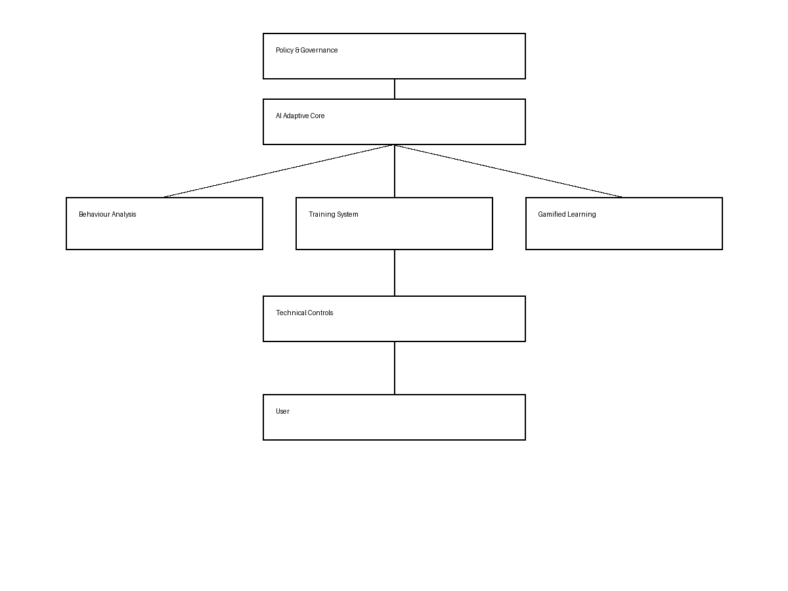

# Adaptive Context-Aware Social Engineering Threat Mitigation (ACASTM) Model



## Overview

The **Adaptive Context-Aware Social Engineering Threat Mitigation (ACASTM)** model is an advanced cybersecurity prototype developed as part of a Master's level systematic literature review. It addresses a critical gap in modern cybersecurity: the failure of static technical controls to mitigate human susceptibility to social engineering attacks (e.g., phishing, BEC, vishing).

Instead of treating the human as the "weakest link," this model integrates behavioral analytics, artificial intelligence, and gamified experiential learning into a unified, adaptive feedback loop. The system dynamically monitors user interactions, computes a real-time composite risk score, and automatically triggers personalized mitigation strategies.

## System Architecture

The prototype is divided into two primary operational layers:

### 1. AI Adaptive Engine (Backend)
Built using Node.js and Express (with a Python/FastAPI option), this layer serves as the core intelligence of the system. It continuously processes behavioral telemetry using the following algorithmic vector:
- **Cognitive Bias Risk**: Derived from simulated phishing click rates vs. reporting rates.
- **Anomaly Score**: Evaluates user actions against active threat intelligence campaigns.
- **Contextual Risk**: Monitors for unusual interaction environments (e.g., off-hours activity, unusual location logins).

Based on the computed risk threshold, the engine automatically flags accounts and assigns targeted training modules.

### 2. Human-Centric Mitigation Interface (Frontend)
Developed in React (Vite), this premium, high-fidelity interface acts as both the defensive shield and the behavioral data generator.
- **User Dashboard**: Displays real-time risk scores, assigned adaptive training, and an algorithmic audit trail ensuring mathematical transparency.
- **Phishing Simulator**: An experiential learning environment where users interact with simulated threats (BEC, spear phishing, baiting, vishing alerts), instantly feeding telemetry back to the AI Core.
- **Governance & Policy Dashboard**: An administrative view providing dynamic visualizations (via Recharts) of the organization's longitudinal risk posture.

## Local Installation & Usage

To run the ACASTM prototype locally, ensure you have Node.js installed.

### Start the AI Backend
```bash
cd backend_node
npm install
npm start
```
*The backend will run on `http://localhost:8000`*

### Start the Frontend Interface
```bash
cd frontend
npm install
npm run dev
```
*The frontend will run on `http://localhost:5173`*

## Deployment Readiness

This project is structured for immediate deployment to modern cloud infrastructure:
- **Frontend**: Prepared for deployment on [Vercel](https://vercel.com/) or [Netlify](https://www.netlify.com/). Run `npm run build` to generate the production-ready static assets.
- **Backend**: Prepared for deployment on [Render](https://render.com/) or [Heroku](https://www.heroku.com/). Ensure the frontend `fetch` URLs are updated to point to the new deployed backend URL.

---
*Developed for Master's Level Academic Evaluation.*
