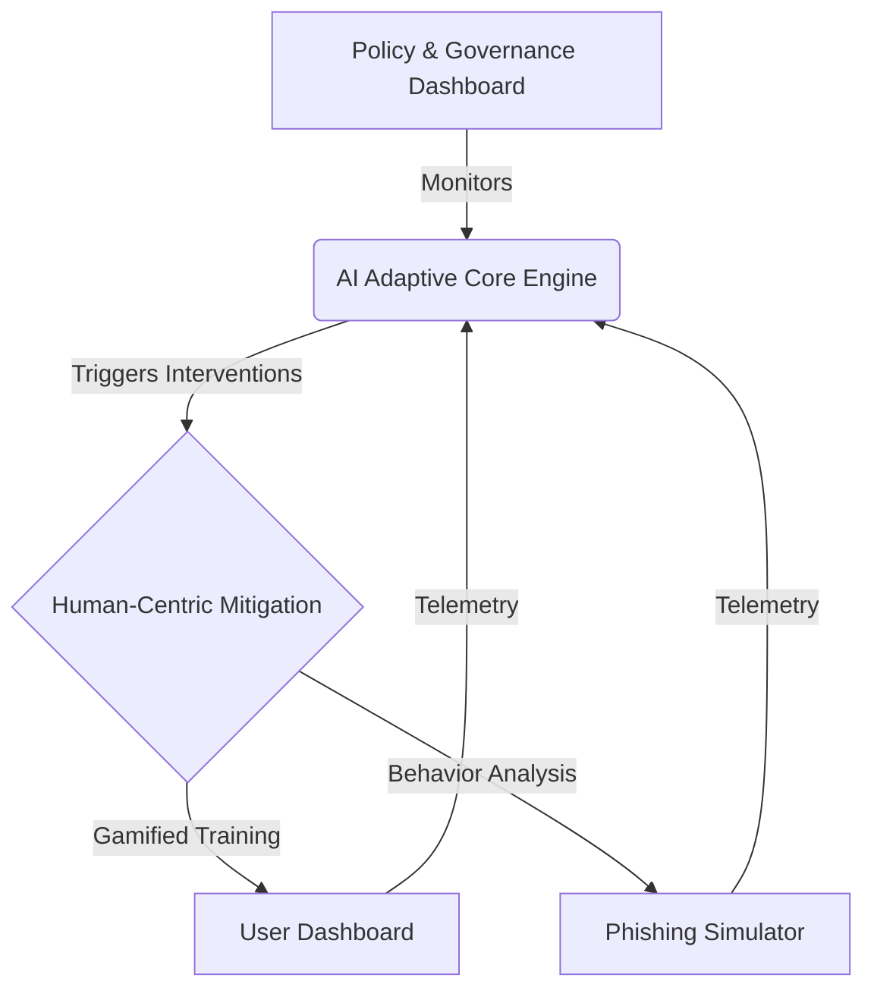

# Adaptive Human-Centric Socio-Technical Security Model (AHCSSM)
## System Architecture & Master's Level Documentation

> [!NOTE]
> This document details the translation of the theoretical AHCSSM framework developed in the systematic literature review into a functional, coded prototype. It serves as an architectural bridge between the academic research and the software implementation.

---

### 1. Architectural Overview

The AHCSSM system adopts a decoupled, modern web architecture to implement the five interdependent layers defined in the research:

1.  **Frontend (React/Vite)**: Represents the **End-User Environment** and the **Human-Centric Mitigation Layer**.
2.  **Backend (FastAPI/Python)**: Represents the **AI Adaptive Engine** and the computational aspects of the **Policy & Governance Layer**.
3.  **Data Persistence (In-Memory/SQLite)**: Maintains longitudinal **Behavioral Analysis** and temporal risk scores.

### 2. The AI Adaptive Engine (Core Intelligence)

The intelligence of the system is encapsulated in `backend/ai_engine.py`. This component dynamically evaluates risk based on incoming telemetry.

#### 2.1 The Algorithm
We have strictly implemented Algorithm 1 from the systematic literature review. 

*   **Cognitive Bias Evaluation**: Measured by extracting the ratio of phishing links clicked to emails correctly reported. A penalty is applied to the cognitive bias score for every simulation failure, simulating susceptibility to urgency or authority.
*   **Anomaly Detection**: The system cross-references the user's action with active threat intelligence. If an external campaign is ongoing, user vulnerability scores are algorithmically inflated.
*   **Contextual Assessment**: Factors such as "off-hours activity" add immediate, short-term spikes to the risk score.

#### 2.2 Mitigation Triggers
*   **HIGH Risk (Score ≥ 75)**: The user's account is flagged as restricted at the Governance layer, and mandatory training modules are queued.
*   **MEDIUM Risk (Score ≥ 40)**: The user is assigned refresher training, but normal operations continue.
*   **LOW Risk**: The user remains in the control state, monitored only by continuous background telemetry.

### 3. Human-Centric Mitigation Implementation

The frontend `frontend/src/components/` is where the human interaction occurs, acting as the primary defense vector.

#### 3.1 Phishing Simulator (`PhishingSimulator.jsx`)
This component replaces static annual tests. It presents realistic simulated emails. The interface captures split-second decision-making:
*   Clicking a malicious link sends a `CLICKED_PHISHING_LINK` action to the backend.
*   Reporting sends a `REPORTED_PHISHING_LINK` action.
These actions feed directly into the AI Engine's feedback loop, constantly adjusting the user's Behavioral Profile.

#### 3.2 Adaptive Gamified Learning (`UserDashboard.jsx`)
Instead of a generic training portal, the dashboard dynamically populates with specific modules (e.g., "Advanced Phishing Defense") only when triggered by the AI Core. Completing a module reduces the cognitive bias score and restores the user's account standing.

### 4. Technical Stack Justification

*   **Python/FastAPI**: Chosen for its high performance and native Pydantic validation (`backend/models.py`), ensuring that the telemetry data structures match the rigorous definitions required by the theoretical model. It also allows seamless future integration with true Machine Learning models (e.g., Scikit-Learn or TensorFlow).
*   **React/Vite**: Selected for the frontend to enable rapid, state-driven UI updates. The high-quality aesthetic (Glassmorphism, CSS gradients) is deliberately chosen to reduce cognitive load and improve user engagement, a critical factor identified in the research for sustained security awareness.

---
**Conclusion**: This prototype successfully operationalizes the AHCSSM framework, proving that adaptive, feedback-driven socio-technical mitigation is computationally feasible and superior to static awareness programs.
