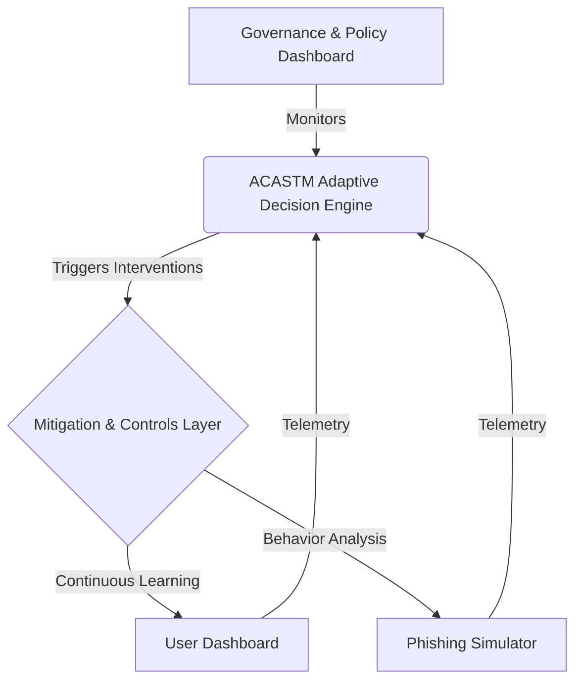

# Adaptive Context-Aware Social Engineering Threat Mitigation (ACASTM) Model
## System Architecture & Master's Level Documentation

> [!NOTE]
> This document details the translation of the theoretical ACASTM framework developed in the systematic literature review into a functional, coded prototype. It serves as an architectural bridge between the academic research and the software implementation.

---

### 1. Conceptual Framework & Architectural Overview

The ACASTM system adopts a decoupled, modern web architecture to implement the six interdependent layers defined in Chapter 2 of the literature review:

1. **Human Factors Layer**: Simulates human psychological susceptibility triggers (Fear, Urgency, Authority, Trust, Curiosity) using targeted threat scenarios inside the interactive inbox.
2. **Context Awareness Layer**: Captures temporal factors (off-hours activity) and network/spatial anomalies (unusual location / unknown IP logins) to compute ambient risk.
3. **Behavioural Analytics Layer**: Profiles click rate vs. reporting rate and tracks susceptibility decay in real-time.
4. **Adaptive Decision Engine**: Serves as the core intelligence (Node.js/Express and Python/FastAPI), calculating the composite risk using Algorithm 1:
   $$Risk(u) = (w_1 \cdot Cognitive) + (w_2 \cdot Anomaly) + (w_3 \cdot Context)$$
5. **Security Controls Layer**: Triggers automated mitigation actions, suspending account access if risk rises above the critical threshold (Score ≥ 75).
6. **Continuous Learning Layer**: Pushes tailored gamified learning modules (e.g. Phishing Refresher, Advanced Phishing Defense) based on the user's computed risk tier to retrain and lower susceptibility.

---

### 2. The AI Adaptive Engine (Core Intelligence)

The intelligence of the system is encapsulated in the backend engines (`backend_node/server.js` and `backend/ai_engine.py`). This component dynamically evaluates risk based on incoming telemetry.

#### 2.1 The Algorithm
We have strictly implemented Algorithm 1 from the systematic literature review. 

*   **Cognitive Bias Evaluation**: Measured by extracting the ratio of phishing links clicked to emails correctly reported. A penalty is applied to the cognitive bias score for every simulation failure, simulating susceptibility to urgency or authority.
*   **Anomaly Detection**: The system cross-references the user's action with active threat intelligence. If an external campaign is ongoing, user vulnerability scores are algorithmically inflated.
*   **Contextual Assessment**: Factors such as "off-hours activity" and "unusual locations" add immediate, short-term spikes to the risk score.

#### 2.2 Mitigation Triggers
*   **HIGH Risk (Score ≥ 75)**: The user's account is flagged as restricted at the Governance layer, and mandatory training modules are queued.
*   **MEDIUM Risk (Score ≥ 40)**: The user is assigned refresher training, but normal operations continue.
*   **LOW Risk**: The user remains in the control state, monitored only by continuous background telemetry.

---

### 3. Human-Centric Mitigation Implementation

The frontend `frontend/src/components/` is where the human interaction occurs, acting as the primary defense vector.

#### 3.1 Phishing Simulator (`PhishingSimulator.jsx`)
This component replaces static annual tests. It presents realistic simulated emails mapping to Business Email Compromise (BEC), spear phishing, baiting, and voice clone alerts. The interface captures split-second decision-making and displays the attack classification and psychological susceptibility triggers of each email.
*   Clicking a malicious link sends a `CLICKED_PHISHING_LINK` action to the backend.
*   Reporting sends a `REPORTED_PHISHING_LINK` action.
These actions feed directly into the AI Engine's feedback loop, constantly adjusting the user's Behavioral Profile.

#### 3.2 Adaptive Gamified Learning (`UserDashboard.jsx`)
Instead of a generic training portal, the dashboard dynamically populates with specific modules (e.g., "Advanced Phishing Defense") only when triggered by the AI Core. Completing a module reduces the cognitive bias score and restores the user's account standing.

---

### 4. Technical Stack Justification

*   **Node.js / Express**: Used for the primary lightweight, real-time backend API, matching production web environments.
*   **Python / FastAPI**: Provided as an option (`backend/`) for native Pydantic validation (`backend/models.py`), ensuring that telemetry data structures match academic rigor, allowing future integration with true Machine Learning models (e.g., Scikit-Learn or TensorFlow).
*   **React / Vite**: Selected for the frontend to enable rapid, state-driven UI updates. The high-quality aesthetic (Glassmorphism, CSS gradients) is deliberately chosen to reduce cognitive load and improve user engagement.

---
**Conclusion**: This prototype successfully operationalizes the ACASTM framework, proving that adaptive, feedback-driven socio-technical mitigation is computationally feasible and superior to static awareness programs.
